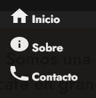
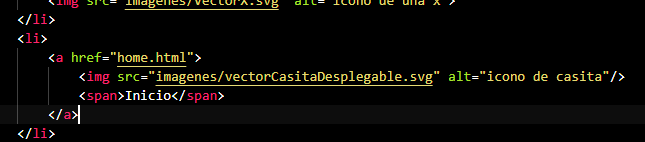
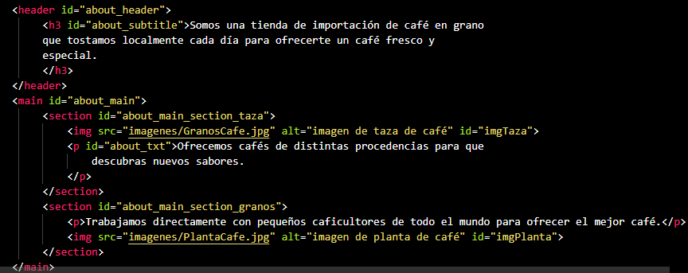

# T4.1-Sestelo-Daniela
Las interfaces creadas en este ejercicio siguen algunas de las leyes de UX para intentar que el diseño sea atractivo y útil para el usuario. Por ejemplo, en el menú del diseño móvil,se utiliza un diseño similar para los iconos que describen cada opción, esto atendería a la ley de semejanza, pero a la vez, al igual que el menú del diseño desktop, ambos siguen la ley de región común que indica al usuario que estos elementos están relacionados,pues representa las opciones de navegación. También se emplea la ley de Hicks, pues el número de opciones presentadas son reducidas, lo que resulta más cómodo para el usuario.

Ambas interfaces son accesibles y para asegurarnos de ello se ha utilizado la extensión de google chrome wave.webaim. Para conseguir que el diseño cumpliese con esta característica se han empleado recursos como la utilización de la etiqueta alt en las imágenes para dotarlas de un texto alternativo, como se observa en el ejemplo capturado más abajo.Además, se ha hecho uso de etiquetas semánticas como  h1 o header y main, para distinguir entre el cuerpo y los encabezados. 

[Enlace al documento figma](https://www.figma.com/file/0dUD4ZtkmSN1AnuwT1pbOa/T4.1SesteloDaniela?type=design&mode=design&t=mRS3LgBdBVBZc2O1-1)

[Enlace a la web](https://danielasestelod.github.io)

